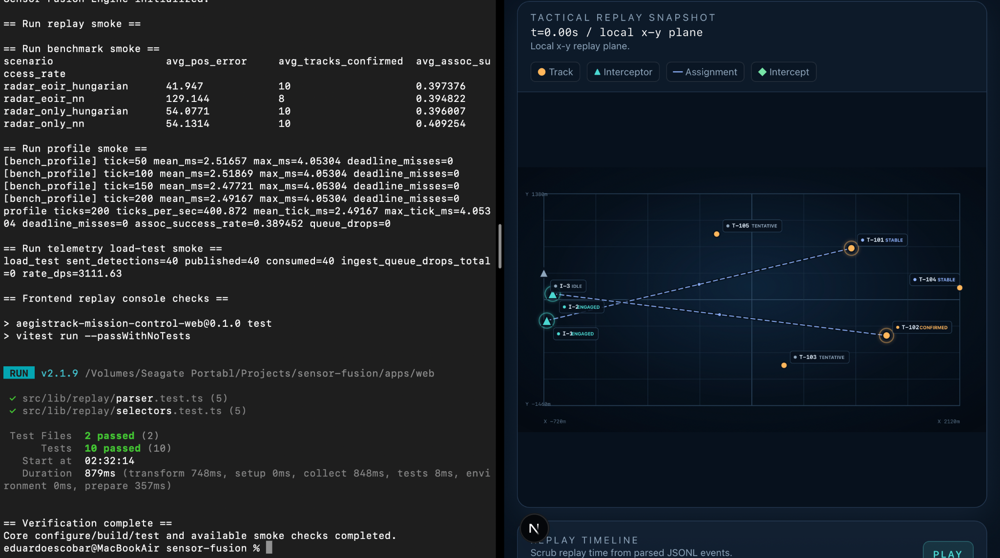

# AegisTrack

<p align="center">
  
</p>

C++20 autonomous mission simulation with multi-sensor fusion (EKF), behavior-tree decision logic, deterministic replay, profiling, load testing, and a TypeScript Mission Replay Console.

## End-to-End Verification

- Single verification script covers build, tests, simulation, replay, benchmark, profile, load test, and frontend replay checks.
- Profile smoke run completed with 0 deadline misses.
- Telemetry load-test smoke run completed with 40/40 detections published/consumed and 0 ingest queue drops.
- Frontend replay console tests passed: 2 test files, 10 tests.

## Overview

AegisTrack is a simulation project for multi-sensor tracking and mission autonomy. The C++ core simulates radar and EO/IR sensing, injects jitter/drop faults, tracks multiple targets with an EKF-based pipeline, and records deterministic JSONL logs for replay and diagnostics.

On top of the simulation core, AegisTrack includes a behavior-tree autonomy layer with stateful mission memory, multi-engagement interceptor assignment, duplicate assignment suppression, and intercept-aware engagement scoring. A TypeScript Mission Replay Console visualizes replay logs as a scrub-able engineering dashboard.

The project is intended to demonstrate systems thinking, simulation timing diagnostics, replayability, and practical mission-autonomy tradeoffs. It is a simulation and diagnostics environment, not an operational defense system or production real-time controller.

## Key Features

- C++20 deterministic simulation loop using CMake.
- Radar and EO/IR sensor simulation.
- Fault injection for measurement jitter and packet/drop behavior.
- EKF-based multi-target tracking.
- Mahalanobis gating and association diagnostics.
- Track lifecycle stability, confirmed-track coasting, and deletion tuning.
- Fragmentation and possible ID-switch diagnostics.
- Behavior-tree autonomy with mission blackboard state.
- Multi-engagement interceptor assignment.
- Duplicate assignment suppression and reconciliation hardening.
- Intercept-aware engagement scoring.
- Deterministic JSONL logging and replay-oriented event contracts.
- Metrics output for tracking, autonomy, intercept, and timing diagnostics.
- TypeScript/Next.js Mission Replay Console for local replay visualization.

## Architecture

```text
Radar / EOIR Simulation
        |
        v
Fault Injection: jitter + drop
        |
        v
Measurement Buffer
        |
        v
EKF Tracker + Mahalanobis Gating + Association
        |
        v
Track Lifecycle Manager
        |
        v
Mission Blackboard
        |
        v
Behavior Tree Autonomy
        |
        v
Interceptor Assignment + Engagement Scoring
        |
        v
Metrics + Deterministic JSONL Logs
        |
        v
Mission Replay Console
```

## System Components

### C++ Simulation Core

The core simulation models a multi-sensor tracking pipeline in C++20. It includes radar and EO/IR measurements, injected sensing degradation, measurement buffering, EKF prediction/update behavior, Mahalanobis gating, association diagnostics, and track lifecycle management.

The tracking layer emits structured events for track updates, stability transitions, coasting behavior, possible fragmentation, and deletion outcomes. Metrics are used to compare tuning changes rather than to claim universal performance.

### Mission Autonomy Layer

The autonomy layer models mission decision logic using behavior-tree execution and a mission blackboard. It tracks active engagements, suppresses duplicate assignments, reconciles completed intercepts, and scores candidate interceptor-track pairings with intercept-aware cost terms.

This layer is designed to make assignment behavior inspectable: decisions are logged with selected tracks, selected interceptors, engagement scores, estimated intercept times, node traces, and assignment reasons.

### Mission Replay Console

The Mission Replay Console is a Next.js/React/TypeScript frontend for replaying deterministic C++ JSONL logs. It visualizes tracks, interceptors, assignment lines, intercept events, injected faults, behavior-tree decisions, a replay timeline, and a compact event stream.

The console runs locally and does not require a live backend for the included sample replay.

## Metrics and Results

The numbers below are simulation-specific comparisons from recent tuning passes. They are useful for showing engineering tradeoffs across track stability, autonomy behavior, and engagement scoring; they are not general performance guarantees. Regenerate benchmark/profile artifacts from the current revision before citing these numbers in a resume or interview.

### Tracking Stability

| Metric | Before | After |
| --- | ---: | ---: |
| Possible ID switches | 59 | 2 |
| Fragmentation warnings | 59 | 2 |
| Confirmed average track age | 0.25s | 3.19s |
| Confirmed tracks created | 64 | 19 |
| Tracks deleted | 75 | 12 |

### Engagement

| Metric | Before | After |
| --- | ---: | ---: |
| Successful intercepts | 5 | 8 |
| Average time to intercept | 1360ms | 1031ms |
| Deadline misses | 0 | 0 |

Later reconciliation and hardening work also aligned `bt_active_engagements` with `interceptors_engaged` while preserving zero deadline misses in the measured scenario.

## Example Runtime Fields

Representative metric fields to look for after a local simulation/profile run:

```text
deadline_misses=0
successful_intercepts_total=<local run value>
possible_id_switch_total=<local run value>
track_fragmentation_warnings_total=<local run value>
tracks_confirmed_avg_age_s=<local run value>
```

## Running Locally

### C++ Simulation

```bash
cmake -S . -B build -DAEGISTRACK_VIZ=OFF
cmake --build build -j1
./build/run_sim --confirmed_delete_misses 10
```

`-j1` is recommended on low-memory machines. Use a higher parallelism value only when the local machine has enough memory for the build.

### Mission Replay Console

```bash
cd apps/web
npm install
npm run dev
```

Then open:

```text
http://localhost:3000/timeline
```

The Timeline page loads the included sample replay fixture and renders the Mission Replay Console without requiring a live backend.

## Proof / Reproducibility

Run these commands from the repository root unless noted otherwise. They are the commands that should back any resume or interview claim about the project.

### Configure

```bash
cmake -S . -B build -DAEGISTRACK_VIZ=OFF
```

`AEGISTRACK_VIZ=OFF` keeps the core proof path independent of optional SFML visualization packages.

### Build

```bash
cmake --build build -j1
```

Use `-j1` on low-memory machines. CI uses limited parallelism for the same reason.

### Test

```bash
ctest --test-dir build --output-on-failure
```

### Run Simulation and Generate Replay Log

```bash
./build/run_sim \
  --enable_logging 1 \
  --log_path logs/mission_control.jsonl \
  --confirmed_delete_misses 10 \
  --enable_viz 0
```

Output artifact: `logs/mission_control.jsonl`.

### Run Replay

```bash
./build/run_replay --input logs/mission_control.jsonl
```

Output artifact: terminal track-state summary.

### Run Benchmark

```bash
./build/run_bench --runs 5 --seed 1 --out_csv results/bench.csv
```

Output artifact: `results/bench.csv` plus terminal aggregate metrics.

### Run Profile

```bash
./build/run_profile \
  --config config/demo_radar_eoir.json \
  --seed 1 \
  --ticks 500 \
  --out results/profile.json
```

Output artifact: `results/profile.json`.

### Run Telemetry Load Test

```bash
./build/run_load_test \
  --virtual_sensors 20 \
  --hz 200 \
  --duration_s 10 \
  --queue_max 10000
```

Output artifact: terminal throughput, published/consumed, and queue-drop summary.

### Run Frontend Replay Console

```bash
cd apps/web
npm install
npm test
npm run dev
```

Then open `http://localhost:3000/timeline`.

The web console uses the included replay fixture by default. To claim the screenshot reflects simulator output, regenerate a C++ JSONL log and wire that artifact into the demo flow before capture.

### Verification Script

```bash
./scripts/verify_project.sh
```

The script runs configure, build, tests, and available smoke checks. It skips frontend checks when `apps/web/node_modules` is missing and does not install dependencies.

## Resume Claims Supported By This Repo

| Claim | Evidence file/module | Command to reproduce | Output artifact |
| --- | --- | --- | --- |
| C++20 deterministic sensor-fusion simulation with radar and EO/IR inputs | `src/tools/run_sim.cpp`, `src/sensors`, `src/scenario` | `./build/run_sim --enable_logging 1 --log_path logs/mission_control.jsonl --enable_viz 0` | `logs/mission_control.jsonl` and terminal metrics |
| EKF-based multi-target tracking with Mahalanobis gating and association diagnostics | `src/fusion_core/ekf_cv.cpp`, `src/fusion_core/gating.cpp`, `src/fusion_core/track_manager.cpp`, `src/fusion_core/association` | `ctest --test-dir build --output-on-failure` | Passing C++ unit tests |
| Track lifecycle diagnostics including confirmation, coasting, deletion, fragmentation, and possible ID-switch metrics | `src/fusion_core/track_manager.cpp`, `src/observability/metrics.cpp` | `./build/run_sim --confirmed_delete_misses 10 --enable_logging 1 --log_path logs/mission_control.jsonl` | Simulator metrics and JSONL replay events |
| Behavior-tree mission autonomy with stateful engagement memory and assignment decisions | `src/decision/mission_behavior_tree.cpp`, `src/decision/blackboard.cpp`, `src/decision/assignment.cpp` | `ctest --test-dir build --output-on-failure` | Behavior-tree and assignment unit tests |
| Intercept-aware engagement scoring and multi-interceptor assignment simulation | `src/decision/engagement_scoring.h`, `src/agents/interceptor`, `src/tools/run_sim.cpp` | `./build/run_sim --enable_interceptor 1 --interceptors 3 --enable_logging 1 --log_path logs/mission_control.jsonl` | Interceptor metrics and replay events |
| Protobuf/gRPC telemetry ingest path with bounded queue and load-test diagnostics | `proto`, `src/services/telemetry_ingest`, `src/tools/run_load_test.cpp` | `./build/run_load_test --virtual_sensors 20 --hz 200 --duration_s 10 --queue_max 10000` | Terminal load-test summary |
| Benchmark/profile tooling for timing, deadline, association, and queue-drop diagnostics | `src/tools/run_bench.cpp`, `src/tools/run_profile.cpp`, `src/tools/bench_harness.cpp` | `./build/run_bench --runs 5 --seed 1 --out_csv results/bench.csv` and `./build/run_profile --out results/profile.json` | `results/bench.csv`, `results/profile.json` |
| TypeScript Mission Replay Console for scrub-able replay visualization | `apps/web/src/components/replay`, `apps/web/src/lib/replay`, `apps/web/src/store/replay-store.ts` | `cd apps/web && npm test && npm run dev` | `/timeline` local replay console |

Do not cite benchmark numbers or test pass status unless the command was run successfully on the current revision.

## Implemented vs Planned

### Implemented

- C++20 simulation targets for `run_sim`, `run_replay`, `run_bench`, `run_profile`, `run_load_test`, telemetry ingest, sensor node, cluster demo, incident replay, and tests.
- Radar and EO/IR measurement simulation with deterministic RNG inputs.
- Fault injection for drop/delay/jitter style degraded sensing.
- EKF constant-velocity tracking, Mahalanobis gating, Hungarian/nearest-neighbor association paths, and track lifecycle diagnostics.
- Behavior-tree mission autonomy, mission blackboard state, interceptor assignment, duplicate suppression, retask handling, and intercept-aware scoring.
- Metrics, JSONL replay logging, benchmark/profile/load-test tools, and replay determinism tests.
- Next.js/React/TypeScript Mission Replay Console for local replay visualization.
- GitHub Actions workflows configured for C++ build/test, sanitizer build/test, and frontend replay/parser tests. Treat remote CI status as unverified until GitHub Actions runs on the current revision.

### Optional Demos

- SFML visualization when local SFML dependencies are available and `AEGISTRACK_VIZ=ON`.
- Frontend screenshots and GIFs captured from a locally running replay console.
- Generated replay artifacts under `logs/` and benchmark/profile artifacts under `results/`.

### Planned / Future Upgrades

- Live C++ to frontend bridge.
- Richer radar and EO/IR sensor models.
- More scenario configuration presets.
- More realistic interceptor dynamics.
- Advanced data association experiments.
- Exportable replay reports for incidents and demonstrations.

## Replay Data

The replay parser supports these JSONL event types:

- `measurement`
- `track_event`
- `track_stability_event`
- `interceptor_state`
- `assignment_event`
- `intercept_event`
- `bt_decision`
- `fault_event`
- `demo_metadata`

The included demo replay currently contains:

| Replay Content | Count |
| --- | ---: |
| Duration | 8.0s |
| Tracks | 5 |
| Interceptors | 3 |
| Injected faults | 5 |
| Intercepts | 3 |
| JSONL events | 82 |

The fixture is a degraded-sensing multi-engagement replay intended to make assignment lines, behavior-tree decisions, coasting, faults, and intercept outcomes visible immediately in the frontend.

## Design Decisions

### Why Behavior Trees?

Behavior trees make autonomy decisions inspectable and modular. For this project, they provide a practical way to represent search, track, engage, maintain, retask, and reconciliation behavior while logging the decision path for replay.

### Why Deterministic JSONL Replay?

Replay logs make complex tracking and autonomy behavior debuggable. JSONL events can be inspected, diffed, loaded by the frontend, and used to reproduce a specific mission timeline without depending on a live simulator process.

### Why Track Lifecycle Tuning?

Raw detection-to-track behavior can produce fragmentation, short-lived confirmed tracks, and possible ID switches under degraded sensing. Lifecycle tuning, coasting, and stability diagnostics make those tradeoffs measurable.

### Why Intercept-Aware Scoring?

Naive assignment can engage the wrong target or leave interceptors poorly allocated. Intercept-aware scoring incorporates engagement feasibility and estimated time-to-intercept so assignment decisions better reflect mission outcomes in the simulation.

## Tech Stack

### Core

- C++20
- CMake
- EKF tracking
- Mahalanobis gating
- Deterministic JSONL logging
- Metrics and replay diagnostics

### Frontend

- Next.js
- React
- TypeScript
- Zustand
- Tailwind CSS
- Vitest

## Future Work

- Live C++ to frontend bridge.
- Richer radar and EO/IR sensor models.
- More scenario configuration presets.
- More realistic interceptor dynamics.
- Advanced data association experiments.
- Exportable replay reports for incidents and demonstrations.
- Additional screenshot and GIF assets for README and portfolio use.

## Resume Summary

AegisTrack is a C++20 simulation and replay project covering sensor fusion, target tracking, mission autonomy, interceptor assignment, deterministic logging, metrics-driven tuning, and a TypeScript replay dashboard. It demonstrates practical engineering work across simulation, autonomy decision logic, diagnostics, and frontend visualization.
